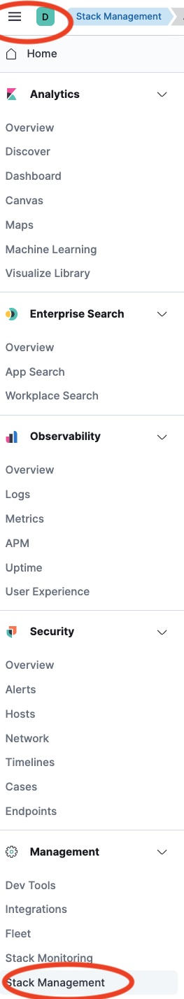
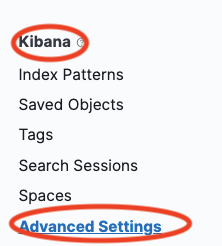
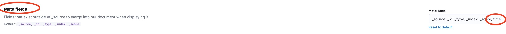
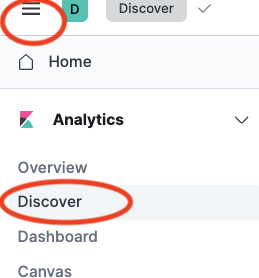
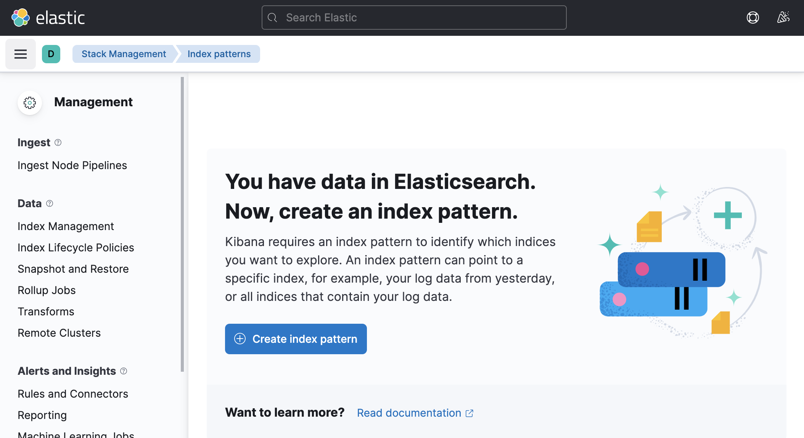

# Lab 5 Logging with EFK Stack

In a complicated distributed system such as Kubernetes, we will have different logs for different components, and extracting insights from logs can be a daunting task. The EFK stack (ElasticSearch, FluentD, Kibana) can help make this task easier.
In this Lab, we are going to deploy EFK stack.

Deploy `online-boutique` app that emits logs to stdout in JSON format.

We will then deploy Cloud Native FluentD logging agent and configure:

  *  **source** directive (input) that will use logs from `/var/log/containers` folder (location used by docker daemon on a Kubernetes node to store stdout from running containers).  This events will be tailed read from text file using  `in_tail` [Input Plugin](https://docs.fluentd.org/input/tail). And parsed using `multi_format` plugin.

  * **filter** directive that will use [kubernetes metadata](https://github.com/fabric8io/fluent-plugin-kubernetes_metadata_filter) plugin to add metadata to the log and parse all kubernetes logs in specific format.

  * **match** directive (output) that will use `out_elasticsearch` Output Plugin and send all logs to ElasticSearch
under `fluentd-*` prefix.

**Objective:**

  * Install Elasticsearch and Kibanna
  * Deploy online boutique Application
  * Install and Configure FluentD
  * Configure ElastackSearch with FluentD


## 0 Create Regional GKE Cluster on GCP

**Step 1** Enable the Google Kubernetes Engine API.
```
gcloud services enable container.googleapis.com
```

**Step 2** From the cloud shell, run the following command to create a cluster with 1 node:

```
gcloud container clusters create k8s-efk-lab \
--region us-central1 \
--enable-ip-alias \
--enable-network-policy \
--num-nodes 1 \
--machine-type "e2-standard-4" \
--release-channel stable
```

```
gcloud container clusters get-credentials k8s-efk-lab --region us-central1
```

## 1 Install Elasticsearch, Kibana, Fluentd Helm Charts
 

### 1.1 Elasticsearch Installation

Create a new namespace for EFK stack:

```
kubectl create ns efk
```

Install Elasticsearch using Helm:

```
helm repo add elastic https://helm.elastic.co
helm install elasticsearch elastic/elasticsearch -n efk
```

Check the status of deployment:

```
kubectl get pods --namespace=efk -l app=elasticsearch-master -w
```


### 1.2 Kibana installation

**Step 1:** Create custom Kibana configuration, that will allow to expose Kibana Dashboard:

```
cat << EOF>> kibana_values.yaml
service:
  type: LoadBalancer
EOF
```

```
cat kibana_values.yaml  
```

Make sure values are correct

**Step 3:** Deploy Kibana Ingress Charts with custom parameters in `efk` namespace:

```
helm install kibana elastic/kibana -n efk --values kibana_values.yaml
```

```
helm list -n efk
```

<!-- 
Set up port forwarding for temporary access to Kibanna:

```
kubectl port-forward deployment/kibana-kibana 5601 -n efk
```

Access Kibana from your browser at `http://localhost:5601` or from cloud shell `Web Preview` (Make sure the port number matches)

For permanent access to Kibana, modify the service type form `ClusterIP` to `LoadBalancer`:

```
kubectl patch svc kibana-kibana -p '{"spec": {"type": "LoadBalancer"}}'
``` 
-->


Access Kibana from your browser using `LoadBalancer` IP on port 5601:

```
kubectl get svc -n efk
```

### 1.3 Fluentd installation

**Step 1:** Create custom Fluentd configuration, below snippet is updating existing `configmap` with some parameters:

```
cat << EOF>> fluentd_values.yaml
fileConfigs:
# here we read the logs from Docker's containers and parse them
  01_sources.conf: |-
    ## logs from podman
    <source>
      @type tail
      @id in_tail_container_logs
      @label @KUBERNETES
      path /var/log/containers/*.log
      pos_file /var/log/fluentd-containers.log.pos
      tag kubernetes.*
      read_from_head true
      <parse>
        @type multi_format
        <pattern>
          format json
          time_key time
          time_type string
          time_format "%Y-%m-%dT%H:%M:%S.%NZ"
          keep_time_key true
        </pattern>
        <pattern>
          format regexp
          expression /^(?<time>.+) (?<stream>stdout|stderr)( (.))? (?<log>.*)$/
          time_format '%Y-%m-%dT%H:%M:%S.%NZ'
          keep_time_key true
        </pattern>
      </parse>
      emit_unmatched_lines true
    </source>

# we use kubernetes metadata plugin to add metadata to the log
  02_filters.conf: |-
    <label @KUBERNETES>
      <match kubernetes.var.log.containers.fluentd**>
        @type relabel
        @label @FLUENT_LOG
      </match>

      # <match kubernetes.var.log.containers.**_kube-system_**>
      #   @type null
      #   @id ignore_kube_system_logs
      # </match>

      <filter kubernetes.**>
        @type kubernetes_metadata
        @id filter_kube_metadata
        skip_labels false
        skip_container_metadata false
        skip_namespace_metadata true
        skip_master_url true
      </filter>

      <match **>
        @type relabel
        @label @DISPATCH
      </match>
    </label>
 # We filtering what logs will be send
  03_dispatch.conf: |-
    <label @DISPATCH>
      <filter **>
        @type prometheus
        <metric>
          name fluentd_input_status_num_records_total
          type counter
          desc The total number of incoming records
          <labels>
            tag ${tag}
            hostname ${hostname}
          </labels>
        </metric>
      </filter>

      <match **>
        @type relabel
        @label @OUTPUT
      </match>
    </label>
# we send the logs to Elasticsearch
  04_outputs.conf: |-
    <label @OUTPUT>
      <match **>
        @type elasticsearch
        host "elasticsearch-master"
        port 9200
        path ""
        user elastic
        password changeme
      </match>
    </label>
EOF
```

**Step 2:** Deploy `Fluentd` Chart with custom parameters in `efk` namespace:

Deploy `Fluentd` with Helm:

```
helm repo add fluent https://fluent.github.io/helm-charts
helm repo update
helm install fluentd fluent/fluentd -n efk --values fluentd_values.yaml
```

## 2 Configure Kibana and Create Index:

Kibana requires an index pattern to access the Elasticsearch data that you want to explore.
An index pattern selects the data to use and allows you to define properties of the fields.

In our case we configured `fluentd` index, that should be populated at `Elasticsearch`


**Step 1:** Locate Kibana URL:

```
kubectl get svc -n efk
```

**Step 2:** Launch the Kibana web interface:

```
loadbalancer_ip:5601
```

!!! result
    You should see your Kibana interface


**Step 3:** Update Kibana Configuration to support `time` Meta fields:

In UI Go to: Management - Stack Management:



**Step 4:** Then Kibana - Advanced Setting:



**Step 5:** Find field: `Meta fields`, and add `time` field as following:




**Step 7:** Create an index pattern. 

In UI  Click: Discover (under analytics)





Click `Create Index Pattern` button.

!!! note
    alternative path: `Management - Stack Management -> Kibana Index Patterns`

**Step 8:** In `Create index pattern` window. Type inside `Index pattern name`: `fluentd*` as the index pattern name. More documentation can be found [here](https://www.elastic.co/guide/en/kibana/7.14/index-patterns.html)


!!! result
    Your index pattern matches 1 source

```
Click Next Step >
```
**Step 9:** Configure which field `Kibana` will use to filter log data by time. In the dropdown, select the `@time` field, and hit `Create index pattern`.

!!! summary
    Our ElasticSearch and Kibana fully configured. You should be able now see some cluster logs in Kibana.


**Step 10:** View Kibana Logs from our GKE cluster:

In UI  Click: Discover (under analytics)

```
In Query search field paste: `kubernetes.namespace_name: kube-system`
In Range field paste: Select last 15 minutes
Click Refresh
```


!!! result
    you can see logs from `kube-system` namespace


!!! note
    You can save you Query for future use


## 3 Deploy onlineboutique application 

Deploy microservices application `onlineboutique`:

Create Namespace `onlineboutique`

```
kubectl create ns onlineboutique
```

Deploy Microservice application
```
git clone https://github.com/GoogleCloudPlatform/microservices-demo.git
cd microservices-demo
```

```
kubectl apply -f ./release/kubernetes-manifests.yaml -n onlineboutique
```

Verify Deployment:

```
kubectl get pods -n onlineboutique
```

## 4 Observe `onlineboutique` logs


**Step 1:** First let's review the logs using `kubectl logs` command locally on the cluster.
We going to check `paymentservice` pod logs

```
export PAYMENTSERVICE_POD=$(kubectl get pods -n onlineboutique | grep paymentservice |awk '{ print $1}')
kubectl logs $PAYMENTSERVICE_POD -n onlineboutique
```

**Step 2:** Now let's review Kibana Logs from our GKE cluster on `onlineboutique` namespace:

```
In Query search field paste: `kubernetes.namespace_name: onlineboutique`
In Range field paste: Select last 15 minutes
Click Refresh
```


!!! result
    We can see all logs from `onlineboutique` namespace

**Step 2:** Now let's review Kibana Logs from `paymentservice` pod only

echo $PAYMENTSERVICE_POD

```
In Query search field paste: `kubernetes.namespace_name: onlineboutique`
In Range field paste: Select last 15 minutes
Click Refresh
```

!!! summary
    Developers should not have access to Kubernetes CLI, however they can get access to Observability tools like Kibana to allow them troubleshooting!

## 5 Review `Fluentd` configuration

In some cases, you want to filter logs from only your applications to be seen by your team. To achieve this, Fluentd should be configured to only intake specific logs so that no resources are wasted. 

Review `sources` configuration:

```
kubectl get configmap -n efk fluentd-config -oyaml | grep -v "#" |  grep -A20 01_sources.conf
```

```
  01_sources.conf: |-
    <source>
      @type tail
      @id in_tail_container_logs
      @label @KUBERNETES
      path /var/log/containers/*.log
      pos_file /var/log/fluentd-containers.log.pos
      tag kubernetes.*
      read_from_head true
      <parse>
        @type multi_format
        <pattern>
          format json
          time_key time
          time_type string
          time_format "%Y-%m-%dT%H:%M:%S.%NZ"
          keep_time_key false
        </pattern>
        <pattern>
          format regexp
          expression /^(?<time>.+) (?<stream>stdout|stderr)( (.))? (?<log>.*)$/
```

!!! note

    `id`: A unique identifier to reference this source. This can be used for further filtering and routing of structured log data

    `type`: Inbuilt directive understood by fluentd. In this case, “tail” instructs fluentd to gather data by tailing logs from a given location. Another example is “http” which instructs fluentd to collect data by using GET on http endpoint. 

    `path`: Specific to type “tail”. Instructs fluentd to collect all logs under /var/log/containers directory. This is the location used by docker daemon on a Kubernetes node to store stdout from running containers

    `pos_file`: Used as a checkpoint. In case the fluentd process restarts, it uses the position from this file to resume log data collection

    `tag`: A custom string for matching source to destination/filters. fluentd matches source/destination tags to route log data


**Step 2** Review `Filter` configuration
```
kubectl get configmap  -n efk fluentd-config -oyaml | grep -v "#" |  grep -A20 03_dispatch.conf
```

```
  02_filters.conf: |-
    <label @KUBERNETES>
      <match kubernetes.var.log.containers.fluentd**>
        @type relabel
        @label @FLUENT_LOG
      </match>


      <filter kubernetes.**>
        @type kubernetes_metadata
        @id filter_kube_metadata
        skip_labels false
        skip_container_metadata false
        skip_namespace_metadata true
        skip_master_url true
      </filter>

      <match **>
        @type relabel
        @label @DISPATCH
      </match>
```

**Step 3** Review `Dispatch` configuration

```
kubectl get configmap  -n efk fluentd-config -oyaml | grep -v "#" |  grep -A20 03_dispatch.conf
```

```
  03_dispatch.conf: |-
    <label @DISPATCH>
      <filter **>
        @type prometheus
        <metric>
          name fluentd_input_status_num_records_total
          type counter
          desc The total number of incoming records
          <labels>
            tag ${tag}
            hostname ${hostname}
          </labels>
        </metric>
      </filter>

      <match **>
        @type relabel
        @label @OUTPUT
      </match>
    </label>
```


**Step 4** Review `Output Plugin` configuration

```
kubectl get configmap  -n efk fluentd-config -oyaml | grep -v "#" |  grep -A10 04_outputs.conf
```

```
  04_outputs.conf: |-
    <label @OUTPUT>
      <match **>
        @type elasticsearch
        host "elasticsearch-master"
        port 9200
        path ""
        user elastic
        password changeme
      </match>
    </label>
```

!!! note

    `match`: tag indicates a destination. It is followed by a regular expression for matching the source. In this case, we want to capture all logs and send them to Elasticsearch, so simply use **
      
    `type`: Supported output plugin identifier. In this case, we are using ElasticSearch which is a built-in plugin of fluentd.
    
    `host/port`: ElasticSearch host/port. Credentials can be configured as well, but not shown here.


## 6 Configure `Fluentd` to specific logs

Let's configure Fluentd to only send `onlineboutique` namespace logs to elasticsearch:


**Step 1:** Modify helm `fluentd_values.yaml` values file for `03_dispatch.conf` config so that only log files that matches `onlineboutique` namespace is labeled to be sent:


```
cd ../
edit fluentd_values.yaml
```

Replace line under `03_dispatch.conf: |-` config:

```
<match **> # Send all logs
```

To: 
```
<match kubernetes.var.log.containers.**_onlineboutique_**>
```

So it looks as following:
```
  03_dispatch.conf: |-
    <label @DISPATCH>
      <filter **>
        @type prometheus
        <metric>
          name fluentd_input_status_num_records_total
          type counter
          desc The total number of incoming records
          <labels>
            tag ${tag}
            hostname ${hostname}
          </labels>
        </metric>
      </filter>

      <match kubernetes.var.log.containers.**_onlineboutique_**>
        @type relabel
        @label @OUTPUT
      </match>
    </label>
```

`<match kubernetes.var.log.containers.**_onlineboutique_**>` will filter out logs with `_onlineboutique_`. This configuration will only relabel the logs that matches the configuration as `@OUTPUT`. As specified in `04_outputs.conf`, only logs labelled as `@OUTPUT` will be sent to elasticsearch. 

Note that this is not the only way to configure fluentd to send one namespace's logs. 

**Step 2:** Install helm diff plugin
```
helm plugin install https://github.com/databus23/helm-diff
```

**Step 3:** Verify diff

```
helm diff upgrade fluentd fluent/fluentd -n efk  --values fluentd_values.yaml
```


**Output:**
```
-       <match **>
+       <match kubernetes.var.log.containers.**_onlineboutique_**>
```

**Step 4:** Update fluentd `configmap` via Helm Upgrade

```
helm upgrade fluentd fluent/fluentd -n efk  --values fluentd_values.yaml
```

**Step 5:** Observe that fluentd stop sending logs for other namespaces than `_onlineboutique_`

```
In Query search field paste: `kubernetes.namespace_name: kube-system`
In Range field paste: Select last 15 minute
Click Refresh
```


!!! result
    No more `kube-system` logs send to the ElasticSearch and hence Kibana can't display them.
    However we can see all historical logs!!! Prior we disabled the logging for all namespaces.

## 7 Cleanup 

Uninstall Helm Charts:


```
helm uninstall fluentd -n efk
helm uninstall kibana -n efk
helm uninstall elasticsearch -n efk
```

Delete GKE cluster:

```
gcloud container clusters delete k8s-efk-lab --region us-central1
```