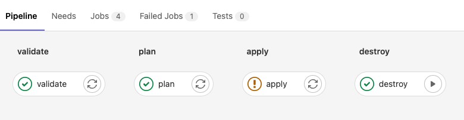

Lab 2 Terraform Fundamentals

**Objective:**

  * Automating through code the configuration and provisioning of resources


# 1 What is Terraform?

Terraform is a tool for building, changing, and versioning infrastructure safely and efficiently. Terraform can manage existing, popular service providers and custom in-house solutions.

Configuration files describe to Terraform the components needed to run a single application or your entire data center. Terraform generates an execution plan describing what it will do to reach the desired state, and then executes it to build the described infrastructure. As the configuration changes, Terraform can determine what changed and create incremental execution plans that can be applied.

The infrastructure Terraform can manage includes both low-level components such as compute instances, storage, and networking, and high-level components such as DNS entries and SaaS features.

## 1.2 Key features

**Infrastructure as code**
Infrastructure is described using a high-level configuration syntax. This allows a blueprint of your data center to be versioned and treated as you would any other code. Additionally, infrastructure can be shared and re-used.

**Execution plans**
Terraform has a planning step in which it generates an execution plan. The execution plan shows what Terraform will do when you execute the apply command. This lets you avoid any surprises when Terraform manipulates infrastructure.

**Resource graph**
Terraform builds a graph of all your resources and parallelizes the creation and modification of any non-dependent resources. Because of this, Terraform builds infrastructure as efficiently as possible, and operators get insight into dependencies in their infrastructure.

**Change automation**
Complex changesets can be applied to your infrastructure with minimal human interaction. With the previously mentioned execution plan and resource graph, you know exactly what Terraform will change and in what order, which helps you avoid many possible human errors.

## Lab Demos

### Lab 1: Simple Terraform 

You will be performing the following steps in Cloud Shell. Launch Cloud Shell from Google Cloud Console

**Step 1** Ensure that you have a GCP Project and Billing enabled on the project. 
``` 
gcloud config set project <PROJECT_ID>
```


**Step 2**  Clone the following gitlab repository to your Cloud Shell, which going to use for our work:
```
git clone https://github.com/Cloud-Architects-Program/ycit020_2022.git
cd ycit020_2022/tf-samples/terraform-basics-1
```

**Step 3** First we will explore a simple Terraform configuration. It has a single main.tf file. In this file you will have a section called provider. By stating the provider as "google", Terraform knows to invoke Google API using the provider to provision resources  
```
provider "google" {
    project = PROJECT_ID
    region = "us-central1"
}
```

In the next section,  you will see the declaration and configuration of compute_instance resource, which will be used to provision a virtual machine. Now, lets execute the terraform using the commands
```  
terraform init 
```
You can notice how the provider plugin has been initialized
```
Initializing provider plugins...
- Finding latest version of hashicorp/google...
- Installing hashicorp/google v4.36.0...
- Installed hashicorp/google v4.36.0 (signed by HashiCorp)
```

**Step 4** You can now run the validate command to check if the Terraform file and syntax are valid 
```
terraform validate 
```

You will find the following error
```
│ Error: Invalid reference
│ 
│   on main.tf line 3, in provider "google":
│    3:     project = PROJECT_ID
```
Open the main.tf file and modify the PROJECT_ID with you actual project-id and run ```terraform validate``` again

**Step 5**
Next step is to preview the resources that are going to be built as part of the Terraform Configuration 
```
terraform plan
```
Scroll through the output to see the resource type and values for each (identify few key ones you would like to know the output for eg: network_ip)
```
Plan: 1 to add, 0 to change, 0 to destroy.
```
**Step 6** Perform a terraform deployment 
```
terraform apply
```
When terraform tries to deploy your resource, you might run into a few issues
```
If its a Permission issue --> make sure you are authenticated to google cloud. You might have already been prompted with login prompt before 
If its an API based error --> then you might not have enabled Compute Engine API in your GCP Project 
If its a invalid configuration error ---> check if you have provided the correct project id 
```
You can delete the resource created using the destroy command
```
terraform destroy
```

### Lab 2: Terraform with multiple config files and variables 

In the next terraform we will look at how Terraform configurations can be separated as multiple files, but can be built together. We will also look at how to use ```variables.tf``` file and ```.tfvars``` files for ease of configuration

**Step 1** Navigate to the second lab folder 
```
cd..
cd terraform-basic-2
```
Analyze the files and the contents of the files.
```
firewall.tf
main.tf
provider.tf
terraform.tfvars
variables.tf
```
Look at the configs on both ```firewall.tf``` and ```provider.tf``` to under resource definition segregation.All of the variable definition and default values are listed in ```variables.tf``` file. The run time values for these variables are provided in the ```.tfvars``` file

**Step 2** Open the main.tf file and modify the PROJECT_ID with you actual project-id and run 
```
terraform init 
terraform validate
terraform plan
``` 

Even though there are terraform files, there is only one planfile. Terraform automatically will create resources in the right order, if output of one is declared as input for other. You can deploy the terraform using 
```
terraform apply
```
You can delete the resource created using the destroy command
```
terraform destroy
```

### Lab 3: Terraform deployment to multiple environments and the use of terraform workspaces 
 In this lab, we will look at storing the terraform state file in a central storage (GCS backend). We will also look at how to deploy the same terraform code to mulitple environments, similar to how we use environment files in high level programming languages.

**Step 1** Navigate to the right folder and take a note of the 3 different ```.tfvars``` file, one for each environment
```
cd..
cd terraform-basic-3
ls
```
**Step 2**  You can also notice that we have a new file called ```backend.tf``` to store our state files in a central bucket instead of on the local filesystem. This ensure consistency when multiple people are working on the terraform file that the state file is synchronized with changes 

Create a storage bucket in the project 
```
gsutil mb gs://<PROJECT-ID>-tfstate
```
Update the ```backend.tf``` file with the appropiriate storage bucket name 
```
terraform {
  backend "gcs" {
    bucket = "PROJECT_ID-tfstate"
  }
}
```

**Step 3** Next, observe closely the different ```.tfvars``` file created for the corresponding environment. Notice the VM name change.  
```
region="us-central1"
project=PROJECT_ID
name="flask-server-dev"
machine_type="f1-micro"
zone="us-central1-c"
```
Update the ```project``` field to your project_id on the ```dev.tfvars``` file.
You can deploy terraform config to different environments by passing the respective .tfvars file as below
```
terraform init
terraform plan -var-file="dev.tfvars"
terraform apply -var-file="dev.tfvars"
```
 Modify the ```project``` field in ```uat.tfvars``` file and proceed with next step
```
terraform plan -var-file="uat.tfvars"
```
If you try to deploy similarly to another environment, you will notice that terraform will force a replacement of the current deployment. 

Because there is only one state file and the state file has a single resource, its trying to replace the resource with new config. We will now use **Terraform workspace** to get it working without replace
You can use 
```
terraform workspace list
``` 
to identify the current workspace. By default it uses the default workspace. Lets create worksapce corresponding to each environment. 
```
terraform workspace new uat
terraform init
terraform plan -var-file="uat.tfvars"
terraform apply -var-file="uat.tfvars"
```
In order to ensure that the state file doesnt get overwritten due to env changes, you need to use separate workspace for each environment. Also naviagte to the GCS bucket and you will be able to see different state file for each environment 
```
gsutil ls gs://<PROJECT-ID>-tfstate
  gs://course-valavan-tfstate/default.tfstate
  gs://course-valavan-tfstate/dev.tfstate
  gs://course-valavan-tfstate/prod.tfstate
  gs://course-valavan-tfstate/uat.tfstate
```
 You can now perform the terraform destroy on these deployments
```
terraform destroy
terraform workspace select default
terraform destroy
```
You can also delete the newly created GCS state files. 

### Lab 4: Building Terraform configuration using DevOps Pipeline (Cloudbuild)
In this lab, we will look to how DevOps team normally deploys the terraform configuration in a pipeline. We will take a closer look at how to build for different environments using the same pipeline and the base terraform code 


**Step 1** Navigate to the right folder and take a note of the 3 different ```.tfvars``` file, one for each environment
```
cd..
cd terraform-basic-4
ls
```
**Step 2** 
Lets look at the cloudbuild.yaml pipeline file 
```
steps:
- id: 'tf init'
  name: 'hashicorp/terraform:1.0.3'
  entrypoint: 'sh'
  args: 
  - '-c'
  - |
      echo "Branch '$BRANCH_NAME'"
      terraform init
      terraform workspace select $BRANCH_NAME || terraform workspace new $BRANCH_NAME

# [START tf-plan]
- id: 'tf plan'
  name: 'hashicorp/terraform:1.0.3'
  entrypoint: 'sh'
  args: 
  - '-c'
  - | 
      terraform workspace select $BRANCH_NAME || terraform workspace new $BRANCH_NAME
      terraform plan -var-file="$BRANCH_NAME.tfvars" -lock=false
# [END tf-plan]

# [START tf-apply]
- id: 'tf apply'
  name: 'hashicorp/terraform:1.0.3'
  entrypoint: 'sh'
  args: 
  - '-c'
  - | 
      terraform workspace select $BRANCH_NAME || terraform workspace new $BRANCH_NAME
      terraform apply -var-file="$BRANCH_NAME.tfvars" -auto-approve -lock=false
```
**Step 3** Before deploying the pipeline, you need to make sure that in the GCP Project IAM console that the ```cloudbuild``` service account needs to have **Compute Admin** Permissions as it uses the service account to deploy the VM

**Step 4** Modify the ```project``` field in the following files 
```
backend.tf
dev.tfvars
uat.tfvars
prod.tfvars
```

**Step 5** On the last line, you should also take note of the ```auto-approve``` flag, which will not wait for the user input before terraform deplyoment. You can trigger the pipeline by specifying the tfvars file to use for the build as Paramter as part of the cloud build job initiation
 
```
 gcloud builds submit --substitutions=BRANCH_NAME="dev"
 gcloud builds submit --substitutions=BRANCH_NAME="uat"
 gcloud builds submit --substitutions=BRANCH_NAME="prod"
```

 If you need to destroy a deployment you can invoke cloudbuild, by specifying the destroy cloudbuild.yaml
```
gcloud builds submit --substitutions=BRANCH_NAME="dev" --config=cloudbuild-destroy.yaml
```

### Lab 5: [Instructor Demo Only] Building Terraform configuration using DevOps Pipeline (GITLAB) 

In the previous pipeline, we werent able to verify the plan output before applying. You will need to build seperate triggers for each and manully deploy the respective pipeline. Gitlab pipelines reduce this complexity to pause between steps in a pipeline and also provides a nice UI to trigger and view the status of deployments. 

Before deploying the gitlab pipeline, you need to make sure that Gitlab can deploy to your project by using a service account. You will need to create a service account first, download the key and upload it in the Gitlab pipeline variables. Before the gitlab pipeline executes the first step, it will authenticate to the project using the Service account key




Sample Terraform Gitlab Pipeline Code 
```
image:
  name: hashicorp/terraform:light
  entrypoint:
    - '/usr/bin/env'
    - 'PATH=/usr/local/sbin:/usr/local/bin:/usr/sbin:/usr/bin:/sbin:/bin'

before_script:
  - rm -rf .terraform
  - terraform --version
  #- mkdir -p ./creds
  #- echo $SERVICEACCOUNT | base64 -d > ./creds/serviceaccount.json
  - export GOOGLE_APPLICATION_CREDENTIALS=${SERVICEACCOUNT}
  - terraform init

stages:
  - validate
  - plan
  - apply
  - destroy

validate:
  stage: validate
  script:
    - terraform validate

plan:
  stage: plan
  script:
    - terraform plan -out "planfile"
  dependencies:
    - validate
  artifacts:
    paths:
      - planfile

apply:
  stage: apply
  script:
    - terraform apply -input=false "planfile"
  dependencies:
    - plan
  when: manual


destroy: 
  stage: destroy
  script:
    - terraform destroy -auto-approve
  when: manual
```

Output and manual trigger options, to be shown by the instructor during the class

### Lab 6: Terrform deployment using modules
In this section, we will look at the advantages provided by Terraform Modules. Modules help with abstraction of complexity, encapsulaion of serveral resources into a simple format and also provides re-usability and ease of use. Similar in concepts to OOO Programming and Classes in higher level languages. 

**Step 1**Navigate to the right folder and take a note of the 3 different ```.tfvars``` file, one for each environment
```
cd..
cd terraform-sql
cat main.tf
```
Here we are building a private MYSQL instance. There are about 4 resouces that get created - including a private network, reserved IP, Service Peering, SQL instance. We need to build all of the configuration ourselves and know that to build a Private Cloud SQL, you will need all 4 resources. It doesnt include best practice configuration like having a Cloud SQL Proxy, configure default username for logging to the database and so on. 

Lets use a pre-built module that has all of the configurations ready and we will use this module to pass input paramaters alone and module can take care of the resource deployment in the backend.

```
cd ..
git clone https://github.com/terraform-google-modules/terraform-google-sql-db.git
cd terraform-google-sql-db/examples
ls
```
Prebuilt configuration on how to use the specific module for certain configurations can be found.
```
mssql-public
mysql-backup-create-service-account
mysql-ha
mysql-private
mysql-public
postgresql-backup-provided-service-account
postgresql-ha
postgresql-public-iam
postgresql-public
```

You will need to how to use the module and what the various parameters in the module mean. But you dont have to reasearch terraform website on how to build each of the resource configuration yourself. 

Apply the configuration using the commands below. Since these are database creations, they generally take about 15-20 mins to complete deployment
```
cd mysql-private
terraform init
terraform plan   ## Enter the project id when prompted
terraform apply  ## Enter the project id when prompted
```
